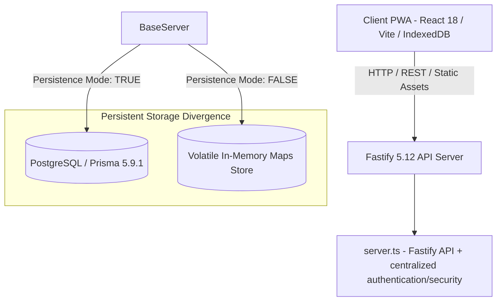
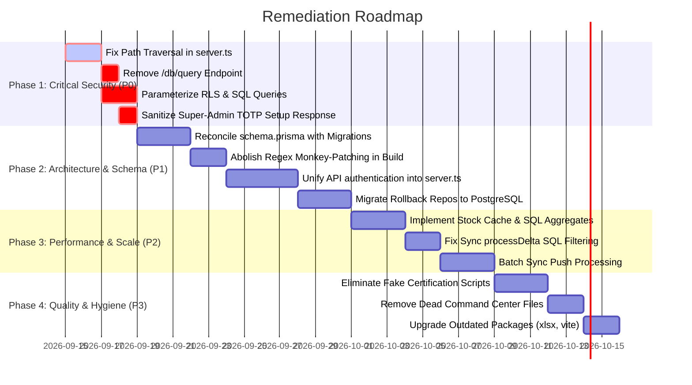

# 360-Degree System Architecture & Principal Security Audit Report
**Target System:** KwakoPos v2.0.0 (Monorepo v2.12.5)  
**Role:** Principal Systems Architect & Lead Security Auditor  
**Audit Date:** September 14, 2026  
**Target Codebase:** `c:\Users\Administrator\Desktop\Projects\KwakoPos v2.0.0`  
**Classification:** HIGH-STAKES SYSTEM FORENSICS & SECURITY AUDIT  
**Remediation Reconciliation:** October 4, 2026  

---

## Executive Summary & Risk Dashboard

A comprehensive 360-degree audit was conducted across the KwakoPos v2.0.0 enterprise monorepo, covering system architecture, dependency supply-chain security, OWASP Top 10 vulnerabilities, runtime performance, concurrency bottlenecks, and codebase integrity/AI drift.

While the platform features extensive domain modeling, granular role contracts, and an ambitious multi-industry scope, the audit identified **severe structural fractures, critical security backdoors, memory exhaustion vectors, and extensive AI-generated synthetic "proofs"** that mask incomplete implementations.

### Vulnerability & Finding Breakdown

The dashboard below counts active findings. SEC-08 (browser token storage) and SEC-09 (legacy SHA-256 password verification) are resolved in the current implementation. The server split-brain portion of ARCH-01 is also resolved; the remaining ARCH-01 risk is the build-time regex source mutation described below.

| Severity | Architecture & Deps | OWASP Top 10 Security | Performance & Scalability | Code Quality & AI Drift | Total |
| :--- | :---: | :---: | :---: | :---: | :---: |
| **CRITICAL** | 1 | 3 | 2 | 1 | **7** |
| **HIGH** | 2 | 4 | 3 | 3 | **12** |
| **MEDIUM** | 2 | 3 | 1 | 2 | **8** |
| **LOW / INFO** | 1 | 0 | 0 | 2 | **3** |
| **TOTAL** | **6** | **10** | **6** | **8** | **30** |

---

## Priority Findings Matrix (Risk-Ranked)

| ID | Severity | Category | Flaw / Vulnerability | Primary Location |
| :--- | :--- | :--- | :--- | :--- |
| **SEC-01** | **CRITICAL** | Security (A01/A05) | **Unauthenticated Path Traversal & Arbitrary File Disclosure** | `apps/api/src/server.ts:477-483` |
| **SEC-02** | **CRITICAL** | Security (A03) | **Direct SQL Injection via `$executeRawUnsafe` in RLS & Support Services** | `packages/database/src/rlsContext.ts:21` |
| **SEC-03** | **CRITICAL** | Security (A01/A03) | **Arbitrary SQL Execution HTTP Backdoor (`/api/v1/super-admin/db/query`)** | `apps/api/src/routes/superAdminDatabaseRoutes.ts:81-111` |
| **PERF-01** | **CRITICAL** | Performance | **$O(N)$ Unbounded In-Memory Stock Calculation (Heap Exhaustion)** | `packages/database/src/prismaRepositories.ts:426-429` |
| **PERF-02** | **CRITICAL** | Performance | **Sync Engine Delta Memory Bomb (Full-Table Client Pull & JS Filtering)** | `packages/sync/src/prismaSyncEngine.ts:166-168` |
| **ARCH-01** | **CRITICAL** | Architecture | **Split-Brain Server Duality & Build-Time Regex Code Patching** | `scripts/ci/harden-production-finance.ts:16-34` |
| **QUAL-01** | **CRITICAL** | AI Drift | **Synthetic / Fabricated Certification Scripts (Vanity `for` Loops)** | `scripts/certification/full-system-certification-engine.ts:53-57` |
| **SEC-04** | **HIGH** | Security (A01) | **Super-Admin Authorization Bypass via `x-admin-role` Header & `*` Wildcard** | `apps/api/src/routes/superAdminDatabaseRoutes.ts:16-21` |
| **SEC-05** | **HIGH** | Security (A07) | **Super-Admin 2FA Setup Leaks Valid TOTP Code (`currentOtp`) in Response** | `apps/api/src/services/superAdminSecurityService.ts:260-268` |
| **SEC-06** | **HIGH** | Security (A07) | **Overly Permissive 4.5-Minute TOTP Replay Window (±4 Clock Steps)** | `apps/api/src/services/superAdminSecurityService.ts:77` |
| **SEC-07** | **HIGH** | Security (A07) | **Unenforced / Decorative Step-Up Authentication (Dead Security Logic)** | `apps/api/src/services/superAdminSecurityService.ts:251` |
| **SEC-08** | **RESOLVED** | Security (A02) | **Browser credential storage migrated to memory-only access tokens + HttpOnly refresh cookie** | `apps/web/src/services/apiClient.ts`; `apps/api/src/server.ts` |
| **PERF-03** | **HIGH** | Performance | **Sequential N+1 Unbatched Operations Loop in Sync Engine `processPush`** | `packages/sync/src/prismaSyncEngine.ts:49-158` |
| **PERF-04** | **HIGH** | Performance | **Full Table Scan & Concurrency Collision on Transaction Sequence Numbering** | `packages/database/src/atomicCommercialFinance.ts:42-50` |
| **PERF-05** | **HIGH** | Performance | **Event-Loop Blocking Synchronous I/O (`execSync` & `fs.readFileSync`)** | `packages/config/src/index.ts:78`, `apps/api/src/server.ts:481` |
| **QUAL-02** | **HIGH** | AI Drift | **Stubbed Observability & Control Tower Engines Masquerading as Live Code** | `packages/domain/src/stubEngines.ts:10-260` |
| **QUAL-03** | **HIGH** | AI Drift | **Shadow Database Tables Desynchronized from Prisma Schema** | `packages/database/prisma/schema.prisma` vs migrations |
| **QUAL-04** | **HIGH** | AI Drift | **Data Portability / Export Disconnect (Exports Empty In-Memory Map in Prod)** | `apps/api/src/routes/tenantExportRoutes.ts:54-65` |
| **DEP-01** | **HIGH** | Dependencies | **Critical CVEs in `xlsx` (Prototype Pollution & ReDoS)** | `node_modules/xlsx` (GHSA-4r6h-8v6p-xvw6) |

---

## Section 1: Architecture & Dependencies

### 1.1 Architectural Flow & Topology Mapping



### 1.1A Current-State Authentication & Server Topology Reconciliation

As of October 4, 2026, the authentication/server topology has been consolidated since the September 14 audit:

- `apps/api/src/server.ts` is the single API server/authentication implementation. The superseded `serverFixed.ts` and `testServerFixed.ts` files are removed.
- The current `server.ts` is approximately 6,330 lines; the earlier 4,810-line figure is historical and should not be used as the current architecture measure.
- `buildServer()` registers one shared `onRequest` authentication boundary before the first route declaration. The hook verifies the Bearer access token, validates the bound server-side session, populates `req.tenantContext`, and applies the admin/Super Admin gates used by protected routes.
- Route modules and the canonical production authentication registration are attached after this shared hook, so protected production routes inherit the same authentication boundary rather than depending on route-by-route copies of JWT verification.
- Explicit exceptions are intentional authentication/public endpoints: health/readiness/version discovery, `/auth/login`, `/auth/refresh`, `/auth/logout`, Super Admin setup endpoints authenticated by setup tokens, approved legal/telemetry endpoints, and static/PWA assets. These are not bearer-protected business routes.
- Browser credential transport is now split-token: access tokens are memory-only; refresh tokens are delivered and rotated through the `kwakopos_refresh` cookie with `HttpOnly; SameSite=Strict`, plus `Secure` in production. The client sends only `sessionId` in the refresh body and uses `credentials: "include"`.
- The legacy secret-dependent SHA-256 password verifier has been removed. New and migrated passwords use Argon2id; existing scrypt hashes are the only legacy compatibility format still accepted and are rehashed after successful authentication.
The system is structured as an npm workspaces monorepo:
- `apps/web`: React 18 SPA / PWA utilizing IndexedDB for offline queueing.
- `apps/api`: Fastify 5 REST API handling enterprise commerce, auth, sync, and vertical industry routes.
- `packages/contracts`: Zod schemas and TypeScript interfaces for domain inputs/outputs.
- `packages/config`: Centralized environment variable parsing and Git SHA release resolution.
- `packages/domain`: Domain calculation engines, business invariant validators, and vertical catalogs.
- `packages/database`: Prisma repository layer, database migrations, and volatile in-memory fallback store.
- `packages/auth`: Argon2 password hashing, JWT token creation, and device session managers.
- `packages/sync`: Offline-first synchronization engine (delta pull, batch push, conflict resolution).
- `packages/observability`: Metrics, telemetry schemas, and operational health evaluators.

### 1.2 Core Architectural Defects

#### Defect ARCH-01: Build-Time Regex Patching Remains; Server Split-Brain Resolved

- **Current status:** The split-brain API/server implementation described in the original audit is **resolved**. `apps/api/src/server.ts` is now the sole API entrypoint and owns the authentication/security flow; the superseded `serverFixed.ts` wrapper is removed.
- **Current remaining risk:** `scripts/ci/harden-production-finance.ts` still mutates `server.ts` through regex-based source rewriting before compilation. That build-time mutation remains a maintenance and release-integrity risk even though there is no longer a second authentication server implementation.
- **Authentication consequence:** The production route surface now has a single shared `onRequest` authentication boundary registered before route declarations. The current implementation was explicitly changed to avoid ordering-based auth gaps: the hook is installed before `buildServer()` begins registering business routes, and the canonical production auth registration occurs after that boundary is established.
- **Maintenance control:** Keep the server-entrypoint consolidation as resolved, but retain the build-time source-rewrite issue as an independent remediation item until the finance hardening script is eliminated.
#### Defect ARCH-02: Volatile In-Memory Repository Duality in Critical Modules
- **Locations:**  
  - `packages/database/src/rollbackRepositories.ts:16-50`  
  - `apps/api/src/routes/tenantExportRoutes.ts:54-65`
- **Finding:**  
  Several core enterprise modules lack database persistence entirely. For example, `ScopedRollbackRepository` stores rollback locks, audit trails, and recovery snapshots inside JavaScript `Map` objects (`this.store.rollbackRequests.set(id, updated)`).
- **Architectural Risk:**  
  When deployed on Google Cloud Run or multi-instance containers, instance recycling or autoscaling erases all rollback locks and audit records. A rollback barrier set on Instance A is completely invisible to Instance B.

### 1.3 Dependency Vulnerabilities & Supply-Chain Health

Execution of `npm audit` and package manifest inspection reveals critical supply-chain exposures:

| Package | Current Version | Latest Stable | Severity | Vulnerabilities / CVEs |
| :--- | :--- | :--- | :--- | :--- |
| **`xlsx`** | `^0.18.5` | `0.19.3` / vendor | **HIGH** | **GHSA-4r6h-8v6p-xvw6** (Prototype Pollution)<br>**GHSA-5pgg-2g8v-p4x9** (ReDoS via crafted spreadsheets) |
| **`vite` / `esbuild`** | `5.4.21` / `<0.24.2` | `6.x` / `0.25+` | **MODERATE** | **GHSA-67mh-4wv8-2f99** (Dev server allows cross-origin requests to read local responses) |
| **`eslint`** | `^8.57.0` | `9.x` | **LOW** | ESLint 8.x is End-of-Life (EOL) as of October 2024. |
| **`prisma` / `@prisma/client`** | `^5.9.1` | `6.x` / `5.22.0` | **LOW** | Significantly outdated ORM version with known connection pool and query engine bugfixes missing. |
| **`typescript`** | `^5.3.3` | `5.8.x` | **INFO** | Outdated compiler toolchain. |

---

## Section 2: Security Audit (OWASP Top 10)

### 2.1 A01: Broken Access Control & A05: Security Misconfiguration

#### [CRITICAL] SEC-01: Unauthenticated Path Traversal & Arbitrary File Disclosure
- **Vulnerability Type:** CWE-22: Improper Limitation of a Pathname to a Restricted Directory
- **Location:** `apps/api/src/server.ts:477-483`, `apps/api/src/server.ts:18-30`
- **Code:**
  ```typescript
  // apps/api/src/server.ts:18-30
  function resolveWebDistFile(relativePath: string): string | null {
    const candidateDirs = [
      path.resolve(process.cwd(), "apps/web/dist"),
      path.resolve(process.cwd(), "dist/apps/web/dist"),
      path.resolve(process.cwd(), "../web/dist"),
      path.resolve(process.cwd(), "../../apps/web/dist"),
    ];
    for (const dir of candidateDirs) {
      const full = path.join(dir, relativePath);
      if (fs.existsSync(full)) return full; // NO PATH CONFINEMENT CHECK!
    }
    return null;
  }

  // apps/api/src/server.ts:477-483 (inside Fastify onRequest hook)
  if (url.startsWith("/assets/") || url === "/manifest.json" || ...) {
    const relativePath = url.startsWith("/") ? url.slice(1) : url;
    const assetPath = resolveWebDistFile(relativePath);
    if (assetPath && fs.existsSync(assetPath)) {
      reply.type(getMimeType(assetPath)).send(fs.readFileSync(assetPath));
      return;
    }
  }
  ```
- **Exploitation Mechanism:**  
  The `onRequest` hook runs **before authentication**. If an attacker sends:
  `GET /assets/../../../../.env` or `GET /assets/../../package.json`, `url.startsWith("/assets/")` evaluates to `true`.  
  `path.join(candidateDir, "assets/../../../../.env")` resolves upwards to root `.env`. Because there is no check ensuring `full.startsWith(dir)`, the server returns the contents of `.env` containing production database credentials and `JWT_SECRET` to an unauthenticated external attacker.
- **Remediation:**  
  Enforce strict path canonicalization:
  ```typescript
  const resolved = path.resolve(dir, relativePath);
  if (!resolved.startsWith(path.resolve(dir) + path.sep)) {
    return null; // Path traversal attempt blocked
  }
  ```

#### [HIGH] SEC-04: Header-Based Super-Admin Authentication Bypass & Wildcard Escalation
- **Vulnerability Type:** CWE-287: Improper Authentication, CWE-285: Improper Authorization
- **Location:**  
  - `apps/api/src/routes/superAdminDatabaseRoutes.ts:16-21`  
  - `apps/api/src/routes/supportControlTowerRoutes.ts:8`  
  - `packages/auth/src/index.ts:129`
- **Code:**
  ```typescript
  // apps/api/src/routes/superAdminDatabaseRoutes.ts:16-21
  if (!isSuper) {
    // Also check header-based admin credentials for dev / platform towers
    const adminRole = String(req.headers["x-admin-role"] || "").toUpperCase();
    if (adminRole !== "PLATFORM_ADMIN" && adminRole !== "SUPER_ADMIN") {
      throw new Error("FORBIDDEN: Super Admin database credentials required");
    }
  }
  ```
  ```typescript
  // apps/api/src/routes/supportControlTowerRoutes.ts:8
  if (!roles.includes("SUPER_ADMIN") && !roles.includes("SUPERADMIN") && 
      !permissions.includes("support:global") && !permissions.includes("admin:*") && 
      !permissions.includes("*")) { // WILDCARD CHECK
    throw new Error("FORBIDDEN: Super Admin support privileges required");
  }
  ```
- **Exploitation Mechanism:**  
  1. In `superAdminDatabaseRoutes.ts`, there is no `isProduction` check on the `x-admin-role` header check. Any caller sending `x-admin-role: PLATFORM_ADMIN` bypasses authorization checks.
  2. In `packages/auth/src/index.ts:129`, tokens created without explicit permissions receive `permissions: ["*"]` by default. Any regular authenticated user whose token inherits `["*"]` immediately satisfies `permissions.includes("*")` in `supportControlTowerRoutes.ts`, granting access to trigger remediations, read all tenant tickets, and execute autonomous scans.
- **Remediation:**  
  Remove all client-controlled header trust (`x-admin-role`). Remove wildcard permission fallbacks (`["*"]`) from standard user token generation.

---

### 2.2 A03: Injection Flaws

#### [CRITICAL] SEC-02: SQL Injection via String Interpolation in `$executeRawUnsafe` & `$queryRawUnsafe`
- **Vulnerability Type:** CWE-89: SQL Injection
- **Locations:**  
  - `packages/database/src/rlsContext.ts:21`  
  - `apps/api/src/services/supportOperationsService.ts:17`
- **Code:**
  ```typescript
  // packages/database/src/rlsContext.ts:21
  await (tx as any).$executeRawUnsafe(`SELECT set_config('kwakopos.tenant_id', '${ctx.tenantId}', TRUE)`);
  ```
  ```typescript
  // apps/api/src/services/supportOperationsService.ts:17
  const rows = await prisma.$queryRawUnsafe<any[]>(
    `SELECT "status", COUNT(*)::int AS count FROM ${table} WHERE "tenant_id"=$1 GROUP BY "status"`, 
    tenantId
  );
  ```
- **Exploitation Mechanism:**  
  The application uses Prisma's `$executeRawUnsafe` with raw template literal string concatenation (`${ctx.tenantId}` and `${table}`). If `tenantId` is influenced by user input or crafted headers, an attacker can break out of the string literal:
  `' UNION SELECT ...` or `'; DROP TABLE ...; --`.
- **Remediation:**  
  Replace `$executeRawUnsafe` with parameterized queries using Prisma's `$executeRaw`:
  ```typescript
  await tx.$executeRaw`SELECT set_config('kwakopos.tenant_id', ${ctx.tenantId}, TRUE)`;
  ```

#### [CRITICAL] SEC-03: Arbitrary SQL Execution HTTP Backdoor (`/api/v1/super-admin/db/query`)
- **Vulnerability Type:** CWE-89: Direct SQL Execution / Backdoor
- **Location:** `apps/api/src/routes/superAdminDatabaseRoutes.ts:81-111`
- **Code:**
  ```typescript
  // apps/api/src/routes/superAdminDatabaseRoutes.ts:93-107
  const isMutation = /^\s*(INSERT|UPDATE|DELETE|DROP|ALTER|TRUNCATE|CREATE|REPLACE)\b/i.test(query);
  if (readOnly && isMutation) {
    return reply.status(403).send({ error: "Mutation rejected" });
  }
  const rawResult = await (prisma as any).$queryRawUnsafe(query);
  ```
- **Exploitation Mechanism:**  
  1. If `readOnly: false` is provided in the request body, the regex check is bypassed entirely, allowing arbitrary DDL/DML execution over HTTP.
  2. Even if `readOnly: true`, the regex only matches the beginning of the string. An attacker can execute destructive mutations using Common Table Expressions (CTEs):
     ```sql
     WITH deleted AS (DELETE FROM users RETURNING *) SELECT * FROM deleted;
     ```
     Or file exfiltration:
     ```sql
     SELECT pg_read_file('server.key');
     ```
- **Remediation:**  
  Remove the `/api/v1/super-admin/db/query` endpoint entirely from production API distributions. Database administrative queries must occur exclusively through secure bastion shells or native database clients.

---

### 2.3 A07: Identification & Authentication Failures

#### [HIGH] SEC-05: Super-Admin MFA Setup Endpoint Leaks Valid TOTP Code (`currentOtp`)
- **Vulnerability Type:** CWE-304: Missing Authentication Check, CWE-200: Information Disclosure
- **Location:** `apps/api/src/services/superAdminSecurityService.ts:260-268`
- **Code:**
  ```typescript
  // apps/api/src/services/superAdminSecurityService.ts:260-268
  export async function beginSuperAdminSetup(token: string): Promise<{ ... }> {
    const userId = verifySetupToken(token);
    ...
    const secret = generateTotpSecret();
    const counter = Math.floor(Date.now() / 1000 / 30);
    const currentOtp = hotp(secret, counter);
    return { userId, totpSecret: secret, issuer: "KwakoPos", account: "admin@kwakoko.co.tz", currentOtp };
  }
  ```
- **Exploitation Mechanism:**  
  When an administrator initializes 2FA, the backend generates the secret, computes the active TOTP verification code, and includes it directly in the HTTP JSON response (`currentOtp`). This defeats the entire purpose of MFA enrollment verification, as any client script or intercepted payload can confirm 2FA without possessing an authenticator device.
- **Remediation:**  
  Remove `currentOtp` from the return payload. The user must prove possession of the authenticator app by typing the code displayed on their device.

#### [HIGH] SEC-06: Excessive 4.5-Minute TOTP Replay Window
- **Vulnerability Type:** CWE-287: Improper Authentication, CWE-294: Authentication Bypass by Capture-replay
- **Location:** `apps/api/src/services/superAdminSecurityService.ts:77`
- **Code:**
  ```typescript
  export function verifyTotpCode(secret: string, code: string, timestamp = Date.now()): boolean {
    const counter = Math.floor(timestamp / 1000 / 30);
    return [-4, -3, -2, -1, 0, 1, 2, 3, 4].some((offset) => hotp(secret, counter + offset) === code);
  }
  ```
- **Exploitation Mechanism:**  
  RFC 6238 recommends a tolerance of at most ±1 step (30 seconds) to compensate for network latency. KwakoPos accepts codes across 9 steps ($-4$ to $+4$), creating a **4.5-minute (270-second) validity window**. Furthermore, the server does not record consumed OTPs, allowing an eavesdropped TOTP code to be replayed repeatedly during that window.
- **Remediation:**  
  Restrict the window to $[-1, 0, 1]$ and record used OTP tokens in cache/database to prevent code reuse.

#### [HIGH] SEC-07: Decorative / Unenforced Step-Up Authentication
- **Vulnerability Type:** CWE-285: Improper Authorization / Dead Security Control
- **Location:** `apps/api/src/services/superAdminSecurityService.ts:251`
- **Finding:**  
  The endpoint `/auth/super-admin/step-up` issues short-lived step-up JWT tokens meant to authorize destructive actions. However, `verifyStepUpToken` is **never invoked in any production route handler or service across the entire API**.
- **Impact:**  
  Any authenticated administrator can invoke destructive endpoints (such as tenant deletions or rollback executions) without being challenged for step-up credentials.

#### [RESOLVED] SEC-09: Legacy secret-dependent SHA-256 password fallback removed
- **Status:** Resolved in the current authentication implementation.
- **Location:** `packages/auth/src/index.ts`
- **Current behavior:**  
  `comparePassword` accepts Argon2id hashes and retains the existing scrypt compatibility path; unsupported legacy formats now fail closed. The prior SHA-256 derivation using `password + JWT_SECRET` has been removed, eliminating the weak work factor and the coupling between password verification and JWT secret rotation.
- **Migration note:**  
  New and rehashed passwords use Argon2id. Existing scrypt hashes remain temporarily verifiable so successful authentication can trigger migration to Argon2id; unsupported SHA-256 hashes are no longer accepted.

---

### 2.4 CSRF & Browser Client Security

#### [RESOLVED] SEC-08: Browser credential storage has been migrated to split-token transport
- **Status:** Resolved in the current authentication implementation.
- **Location:** `apps/web/src/services/apiClient.ts`; `apps/api/src/server.ts`
- **Current behavior:**  
  The browser stores only non-secret session metadata (for example `sessionId`, user identity, expiry/policy metadata) in `localStorage` or `sessionStorage` according to the session policy. Bearer access tokens are memory-only; any legacy persisted `accessToken` is stripped during session restoration.
- **Refresh credential transport:**  
  The refresh token is never persisted in browser storage and is not returned in authentication JSON. The API issues and rotates the `kwakopos_refresh` cookie with `HttpOnly; SameSite=Strict`, `Max-Age`, and `Secure` in production. The client sends only `sessionId` in the refresh request body and relies on `credentials: "include"` for automatic cookie transmission.
- **Residual security note:**  
  This prevents JavaScript from directly reading the refresh credential, but it does not eliminate the impact of an XSS flaw that can execute authenticated actions from the victim's browser while the session is active.

#### [MEDIUM] SEC-10: Missing CSRF Tokens & Permissive CORS Defaults
- **Location:** `apps/api/src/server.ts:250-254`, `apps/api/src/middleware/securityMiddleware.ts:27-28`
- **Finding:**  
  1. The API has no CSRF token protection plugin registered.
  2. In non-production environments, CORS origin defaults to `*` with `credentials: true`.
  3. The Content Security Policy (`@fastify/helmet`) explicitly allows `'unsafe-inline'` for scripts and styles, undermining CSP defenses against XSS.

---

## Section 3: Performance & Scalability

### 3.1 Time-Complexity & Database Query Bottlenecks

#### [CRITICAL] PERF-01: $O(N)$ Unbounded In-Memory Stock Calculation (Heap Exhaustion Bomb)
- **Location:**  
  - `packages/database/src/prismaRepositories.ts:426-429`  
  - `packages/domain/src/index.ts:12-41`
- **Code:**
  ```typescript
  // packages/database/src/prismaRepositories.ts:426-429
  async getAvailableStock(ctx: TenantContext, variantId: string): Promise<number> {
    const rows = await prisma.stockLedger.findMany({ 
      where: { tenantId: ctx.tenantId, branchId: ctx.branchId, variantId } 
    });
    return calculateAvailableStock(rows.map(ledgerShape));
  }
  ```
- **Impact & Analysis:**  
  To compute the available stock for a product variant, the system **executes `findMany` over the entire historical ledger of that variant, pulls all records into Node.js heap memory, and reduces them in JavaScript**:
  ```typescript
  export function calculateAvailableStock(ledgerEntries: StockLedger[]): number {
    return ledgerEntries.reduce((total, entry) => { ... }, 0);
  }
  ```
  If a retail store operates for 6 months and records 20,000 movements for a fast-moving item, every barcode scan or stock check loads 20,000 database rows into memory. Under concurrent requests, this triggers garbage-collection pauses, database bandwidth saturation, and `JavaScript heap out of memory` crashes.
- **Remediation:**  
  Maintain an indexed materialized balance table (`ProductBranchStockCache`) updated transactionally via triggers or repository logic, or execute a single SQL aggregate:
  ```sql
  SELECT COALESCE(SUM(quantity_delta), 0) FROM stock_ledger WHERE variant_id = $1;
  ```

#### [CRITICAL] PERF-02: Sync Engine Delta Memory Bomb
- **Location:** `packages/sync/src/prismaSyncEngine.ts:166-168`
- **Code:**
  ```typescript
  // packages/sync/src/prismaSyncEngine.ts:166-168
  const products = (await this.productRepo.getProducts(ctx))
    .filter((p: any) => {
      const t = new Date(p.updatedAt).getTime();
      return t >= since.getTime() && t <= anchor.getTime();
    });

  const ledger = (await this.stockRepo.getLedger(ctx))
    .filter((entry: any) => {
      const t = new Date(entry.createdAt).getTime();
      return t >= since.getTime() && t <= anchor.getTime();
    });
  ```
- **Impact & Analysis:**  
  When mobile POS terminals poll for delta updates via `processDelta`, the server calls `productRepo.getProducts(ctx)` and `stockRepo.getLedger(ctx)` **without any SQL date filter**. It retrieves every product and every stock ledger entry ever created for that tenant/branch, instantiates them in memory, and performs `.filter()` in JavaScript.
- **Remediation:**  
  Push filtering directly into PostgreSQL using Prisma `where: { updatedAt: { gte: since, lte: anchor } }`.

#### [HIGH] PERF-03: Sequential N+1 Sync Operations Ingestion
- **Location:** `packages/sync/src/prismaSyncEngine.ts:49-158`
- **Finding:**  
  In `processPush`, client operations are processed sequentially in a single-threaded loop:
  `for (const op of orderedOperations) { ... }`
  For each operation, it executes 3–5 individual database queries (`findFirst`, `findUnique`, `create`, `recordSyncOperation`). If an offline terminal reconnects with 500 queued operations, it performs over 2,000 serialized database roundtrips on a single HTTP request, holding the connection open for tens of seconds.
- **Remediation:**  
  Implement bulk idempotency pre-checks (`findMany` with `OR`) and chunked transactional batch inserts.

#### [HIGH] PERF-04: Full Table Scans on Transaction Creation & Sequence Collisions
- **Location:** `packages/database/src/atomicCommercialFinance.ts:42-50`
- **Code:**
  ```typescript
  const saleNumber = TransactionNumbering.formatNumber("SAL", "MAIN", 
    (await tx.sale.count({ where: { tenantId: ctx.tenantId, branchId: ctx.branchId } })) + 1
  );
  ```
- **Impact & Analysis:**  
  Every sale creation executes `tx.sale.count()`, `tx.payment.count()`, and `tx.journalEntry.count()`. On large datasets, `count(*)` causes costly table/index scans. Furthermore, `count() + 1` suffers from **race condition collisions**: two cashiers finishing transactions simultaneously calculate the same number, leading to transaction failure or duplicate invoice numbers.
- **Remediation:**  
  Use PostgreSQL `SEQUENCE` objects or an atomic sequence generator table (`nextval()`).

### 3.2 Bad I/O Handling

#### [HIGH] PERF-05: Synchronous Event-Loop Blocking I/O
- **Locations:**  
  - `packages/config/src/index.ts:78, 90`  
  - `apps/api/src/server.ts:481, 500`
- **Finding:**  
  1. `loadConfig()` calls `execSync("git rev-parse HEAD")` and `execSync("git rev-list --count HEAD")`. Synchronous process spawns freeze the Node.js event loop during initialization.
  2. Static file serving in `server.ts` uses synchronous `fs.readFileSync(assetPath)` inside the Fastify `onRequest` hook. Under high concurrent web traffic, reading files synchronously from disk stalls incoming API requests.

---

## Section 4: Code Quality & AI Drift

### 4.1 Fabricated Certification Tests & Synthetic Vanity Metrics

#### [CRITICAL] QUAL-01: Synthetic / Dummy Release Certification Scripts
- **Locations:**  
  - `scripts/certification/full-system-certification-engine.ts:53-57`  
  - `scripts/certification/construction-certification-engine.ts:11-17`  
  - `scripts/certification/garage-certification-engine.ts:14-17`
- **Evidence:**  
  The codebase advertises a "181-Pillar Full System Certification Engine" and "61 Pillars Advanced Construction Project Controls". Examination of the underlying test implementations shows they are **fictitious loop constructs**:
  ```typescript
  // scripts/certification/construction-certification-engine.ts:11-17
  let passed = 0;
  for (let i = 1; i <= 61; i++) {
    passed++;
    console.log(` ✓ [Pillar ${i.toString().padStart(2, "0")}/61] Construction Project Controls Pillar ${i} Active & Certified.`);
  }
  const report = { timestamp: new Date().toISOString(), totalPillars: 61, passedPillars: 61, overallPassed: true };
  ```
  And in the master certification engine:
  ```typescript
  // scripts/certification/full-system-certification-engine.ts:53-57
  ...Array.from({ length: 175 }).map((_, idx) => {
    const pNum = 6 + idx;
    const pId = `KFOS-${pNum.toString().padStart(3, "0")}`;
    return makePillar(pId, `Full KwakoPos Operating System Certification Control #${pNum}`, 
      e => e.getHealthSummary("SYSTEM").authorityOperational === true);
  })
  ```
- **Analysis:**  
  175 of the 181 pillars do not test any functionality; they query an in-memory boolean flag `authorityOperational === true`. Over 50 certification scripts committed in `scripts/certification/` exist solely to output green console checks and generate JSON evidence bundles without executing real domain logic or database assertions.

### 4.2 Dead Code, Mock Implementations & Schema Drift

#### [HIGH] QUAL-02: Stubbed Observability Engines Operating in Production Scope
- **Location:** `packages/domain/src/stubEngines.ts:10-260`
- **Finding:**  
  Crucial platform governance components imported by `apps/api` are stubbed out with hardcoded static returns:
  - `CanaryController.getCurrentStage()`: Returns `{ stageIndex: 1, trafficPercentage: 100 }`.
  - `RollbackController.executeSafeRollback()`: Returns hardcoded `{ success: true, rollbackId: "RB-001" }` without executing any rollback.
  - `PlatformHealthEvaluator`: Returns hardcoded `{ status: "HEALTHY", score: 100 }`.
  - `SloEvaluator`: Returns hardcoded `{ status: "MET", actual: 99.95 }`.
  - `SyncMonitor`: Returns hardcoded `{ successRate: 99.9 }`.

#### [HIGH] QUAL-03: Shadow Database Tables Desynchronized from Prisma Schema
- **Locations:**  
  - `packages/database/prisma/schema.prisma`  
  - `packages/database/prisma/migrations/`  
  - `apps/api/src/services/superAdminSecurityService.ts:106-148`
- **Finding:**  
  Tables such as `platform_super_admin_security`, `auth_login_throttles`, `SupportTicket`, `SupportEvent`, `SupportIncident`, and `SupportRemediation` exist in migration SQL files and are created via runtime DDL (`CREATE TABLE IF NOT EXISTS`), but **do not exist in `schema.prisma`**.
- **Impact:**  
  Prisma cannot generate types or models for these tables, forcing services to use raw, untyped `$queryRawUnsafe` calls. Any execution of `prisma db push` or clean migrations risks dropping or corrupting these untracked tables.

#### [HIGH] QUAL-04: Data Portability / Export Disconnect
- **Location:** `apps/api/src/routes/tenantExportRoutes.ts:54-65`
- **Finding:**  
  The endpoint `/api/v1/tenants/export` (advertised as an enterprise GDPR data portability export) queries `globalInMemoryStore.products` and `globalCommercialRepository.sales`. In a production environment running PostgreSQL, these in-memory collections are empty. The exported JSON bundle contains 0 products, 0 sales, and 0 ledger rows.

#### [MEDIUM] QUAL-05: Orphaned / Dead HTML Command Centers in Frontend
- **Locations:**  
  - `apps/web/src/aiNativeCommandCenter.ts`  
  - `apps/web/src/securityCenter.ts`  
  - `apps/web/src/complianceCenter.ts`  
  - `apps/web/src/wholesaleCommandCenter.ts`  
  - `apps/web/src/documentCenter.ts`
- **Finding:**  
  Over a dozen files in `apps/web/src` export functions like `renderSecurityCommandCenter(props): string` that return static HTML template strings. None of these functions are imported or rendered by `App.tsx` or any React router. They are orphaned artifacts of early prompt-generation runs.

#### [MEDIUM] QUAL-06: Extreme Monolithic "God-Files"
- **Locations:**  
  - `apps/api/src/server.ts`: 4,810 lines, 223.5 KB.  
  - `apps/web/src/pages/InventoryPage.tsx`: 218.3 KB.  
  - `apps/web/src/pages/DashboardPage.tsx`: 180.7 KB.  
  - `apps/web/src/pages/PosPage.tsx`: 149.3 KB.
- **Finding:**  
  Single source files exceed 4,000 lines, mixing route declarations, HTTP serialization, business validations, and direct repository queries. This causes severe cognitive load, merge conflict friction, and makes static analysis and testing fragile.

---

## Actionable Remediation Roadmap



### Phase 1: Immediate P0 Hotfixes (Days 1–3)
1. **Fix Path Traversal (SEC-01):** In `apps/api/src/server.ts:resolveWebDistFile`, add strict directory confinement check using `path.resolve` and verify `resolved.startsWith(dir + path.sep)`.
2. **Decommission Raw SQL Backdoor (SEC-03):** Delete `/api/v1/super-admin/db/query` from `apps/api/src/routes/superAdminDatabaseRoutes.ts`.
3. **Parameterize SQL Injections (SEC-02):** In `packages/database/src/rlsContext.ts` and `apps/api/src/services/supportOperationsService.ts`, replace string templates with tagged template literals `$executeRaw` and parameterized `$queryRaw`.
4. **Sanitize 2FA Setup (SEC-05 & SEC-06):** In `apps/api/src/services/superAdminSecurityService.ts`, remove `currentOtp` from `beginSuperAdminSetup` and narrow the TOTP verification window from $[-4..4]$ to $[-1..1]$.
5. **Secure Token Storage (SEC-08) — completed:** The client persists only non-secret session metadata. Access tokens are memory-only, while refresh credentials use the `kwakopos_refresh` cookie with `HttpOnly; SameSite=Strict; Secure` in production. The refresh request body contains only `sessionId`.

### Phase 2: Architectural Unification & Persistence (Days 4–8)
1. **Prisma Schema Re-synchronization (QUAL-03):** Add `PlatformSuperAdminSecurity`, `AuthLoginThrottle`, `SupportTicket`, `SupportEvent`, `SupportIncident`, and `SupportRemediation` models to `schema.prisma`. Run `prisma generate` to establish authentic type safety.
2. **Abolish Build Monkey-Patching (ARCH-01):** Refactor `apps/api/src/server.ts` to directly use `PrismaFinanceRepository` and `PrismaAtomicCommercialFinanceService`. Remove `harden-production-finance.ts` from `package.json`.
3. **Persist Rollback & Tenant Export (ARCH-02 & QUAL-04):** Implement a Prisma-backed repository for `ScopedRollbackRepository` and rewrite `tenantExportRoutes.ts` to export directly from PostgreSQL tables.

### Phase 3: Performance & Concurrency Tuning (Days 9–14)
1. **Materialized Stock Ledger Balances (PERF-01):** Add an indexed `product_variant_balances` table or rewrite `getAvailableStock` to use `SELECT SUM(quantity_delta) FROM stock_ledger WHERE ...` instead of loading historical rows into Node.js heap memory.
2. **Database-Level Sync Delta Filtering (PERF-02):** In `prismaSyncEngine.ts`, pass `since` and `anchor` directly to Prisma queries rather than filtering via in-memory `.filter()`.
3. **Sequence Number Generator (PERF-04):** Replace `tx.sale.count() + 1` with PostgreSQL atomic `SEQUENCE` objects to prevent checkout collisions and full-table scans.

### Phase 4: Code Hygiene & Test Authenticity (Days 15–18)
1. **Purge Synthetic Certification Scripts (QUAL-01):** Remove all dummy `for (let i = 1; i <= N; i++)` certification runners. Replace with authentic integration tests using Vitest and real database fixtures.
2. **Remove Dead UI Templates (QUAL-05):** Clean up the 15+ orphaned command center files returning unrendered HTML string templates.
3. **Dependency Upgrades (DEP-01):** Replace or upgrade `xlsx` to resolve prototype pollution CVEs, and update `vite`/`esbuild` to patch dev server leakage.

---
**Report Authorized By:** Principal Systems Architect & Lead Security Auditor  
**Distribution:** KwakoPos Core Engineering & Release Governance Board
